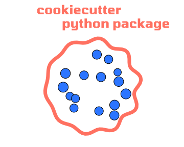

# cookiecutter-python-package

A modern Python package cookiecutter.



## Features

- [Nox](https://nox.thea.codes/en/stable/) for isolated testing
- Modern Python dependency management with [uv](https://astral.sh/blog/uv)
- [pytest](https://docs.pytest.org/en/7.4.x/) for testing
- Code formatting with [ruff](https://docs.astral.sh/ruff/) (including formatting and import sorting)
- [xdoctest](https://github.com/Erotemic/xdoctest) to check that examples of use in docstrings work as intended
- [typeguard](https://github.com/agronholm/typeguard) for run-time type checking
- Git pre-commit hooks for code quality:
  - [Ruff](https://docs.astral.sh/ruff/) lint/format/sort imports
  - check for added large files
    - check TOML
    - check YAML
    - end of file fixer
    - trailing whitespace trimmer
    - [nbstripout](https://github.com/kynan/nbstripout) for ensuring notebook outputs are not committed
    - [pydoclint](https://github.com/jsh9/pydoclint) for checking docstrings agree with function definitions
- Continuous Integration/Continuous Deployment with [GitHub Actions](https://github.com/features/actions)
  - covers multiple versions of Python, and all three major operating systems
  - tests with [pytest](https://docs.pytest.org/en) + [Nox](https://nox.thea.codes/en/stable/)
    - Test cover with [Coverage.py](https://coverage.readthedocs.io/)
    - Automatic [release labeler](https://github.com/actions/labeler)
    - Automatic publishing to [PyPI](https://pypi.org/)
    - Dynamic docs build and deploy using [Quarto](https://quarto.org/) for a docs site, [Quartodoc](https://machow.github.io/quartodoc) for automatic API documentation, and [GitHub Pages](https://pages.github.com/) for deployment.

Read more about it in the [accompanying blog post](https://aeturrell.com/blog/posts/ultra-modern-python-cookiecutters/).

## Prerequisites

- the Python [package manager uv](https://docs.astral.sh/uv/)
- `cookiecutter` package (link [here](https://github.com/cookiecutter/cookiecutter))
- an installation of [Quarto](https://quarto.org/)

## How to use this template

To install cookiecutter, which will help you populate the template with details like your project's name, run

```bash
uv tool install cookiecutter
```

To create a new project folder based on this cookie cutter:

```bash
uv tool run cookiecutter https://github.com/aeturrell/cookiecutter-python-package.git
```

The new project folder will appear within the folder you ran the command in.
